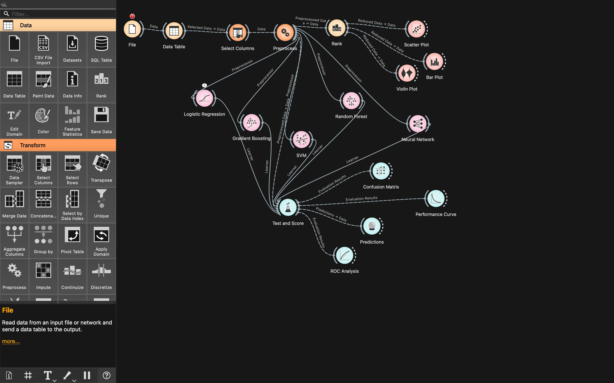

# ALS Classification using Orange 3

Detecting Amyotrophic Lateral Sclerosis (ALS) from sustained vowel recordings, using acoustic features and supervised machine learning models built visually in Orange 3. This project was developed into an IEEE-format conference paper.

## Problem Statement

Amyotrophic Lateral Sclerosis (ALS) is a progressive neurological disease that affects motor neurons, often impairing speech early on. This project explores whether subtle acoustic changes in sustained vowel sounds can be used to distinguish ALS patients from healthy individuals using machine learning — offering a path toward non-invasive, early screening.

## Dataset

- **Source**: Speech recordings collected at the Republican Research and Clinical Center of Neurology and Neurosurgery, Minsk, Belarus
- **Size**: 128 vowel recordings (sustained "a" and "i" sounds) from 64 individuals — 31 with ALS, 33 healthy controls
- **Format**: 44.1 kHz, 16-bit PCM audio, recorded on smartphones with headsets

## Features Extracted

| Feature | What it Captures |
|---|---|
| MFCC | General spectral characteristics of speech |
| Jitter | Pitch stability |
| Shimmer | Loudness fluctuation |
| Formants (F1–F3) | Vocal tract shape |
| HNR | Harmonics-to-noise (voice clarity) |
| GNE | Breathiness |

## Workflow Overview

The Orange workflow (`ALS_CLASSIFICATION_WORKFLOW.ows`) follows this pipeline:

1. **File** → loads the speech feature dataset
2. **Data Table** → inspect raw data, identify missing values
3. **Select Columns** → retain speech-relevant features (pitch, formants, clarity); drop low-signal columns like age/gender
4. **Preprocess** → handle missing values, normalize features, encode categorical class labels
5. **Rank** → identify the most discriminative features between ALS and healthy groups
6. **Visualization** → Scatter Plot, Violin Plot, and Bar Plot to compare ALS vs. healthy distributions (jitter and shimmer showed significant separation)
7. **Modeling** → five classifiers trained in parallel:
   - Logistic Regression
   - Support Vector Machine (SVM)
   - Random Forest
   - Gradient Boosting
   - Neural Network
8. **Test and Score** → cross-validated performance comparison (AUC, accuracy, F1, precision, recall, MCC)
9. **Predictions** + **Confusion Matrix** + **ROC Analysis** → detailed error analysis and threshold tuning

## Results

| Model | Accuracy | AUC | Notes |
|---|---|---|---|
| Logistic Regression | ~70% | 0.78 | Simple, interpretable baseline |
| SVM | ~70% | 0.70 | Best overall — 84% accuracy and top ROC AUC in final evaluation |
| Random Forest | ~72% | 0.82 | Best AUC among ensemble models, useful for feature importance |
| Gradient Boosting | ~78% | — | Strong on accuracy, less consistent across other metrics |
| Neural Network | 75% precision, 0.75 F1, 0.50 MCC | — | Best balance across precision, recall, and F1 |

**Key finding**: Jitter, shimmer, and MFCC features showed statistically significant differences between ALS patients and healthy controls. SVM achieved the strongest overall performance with 84% accuracy.

## Workflow Screenshot

## Files

- `ALS_CLASSIFICATION_WORKFLOW.ows` — Orange workflow file
- `ALS_Research_Paper.pdf` — Full IEEE-format conference paper detailing methodology, results, and conclusions

## How to Run

Open `ALS_CLASSIFICATION_WORKFLOW.ows` in [Orange 3](https://orangedatamining.com/). Double-click any model widget or the **Test and Score** widget to view live evaluation metrics.

## Future Work

- Larger, more diverse datasets
- Deep learning approaches (e.g., CNNs/RNNs on raw audio)
- Mobile app for point-of-care ALS screening
