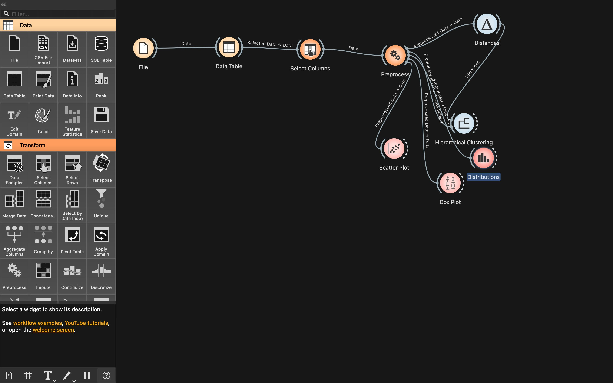
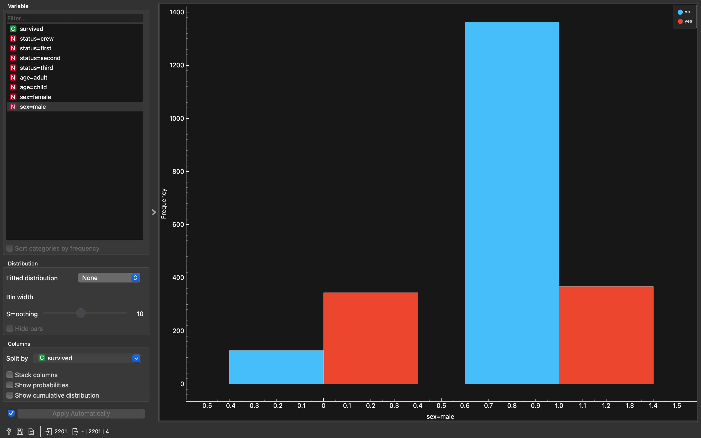

# Clustering Analysis using Orange 3

An unsupervised learning project applying hierarchical clustering to a numeric dataset, with visual exploration of the resulting groupings, built as a workflow in Orange 3.

## Problem Statement

Given a dataset without labeled outcomes, the goal is to discover natural groupings (clusters) among the records based on similarity across their features, and to visually explore how these clusters differ.

## Workflow Overview

The Orange workflow (`clustering_orange_assign.ows`) follows this pipeline:

1. **File** → loads the dataset
2. **Data Table** → inspect the raw data
3. **Select Columns** → choose the numeric features to use for clustering
4. **Preprocess** → normalize/scale features so no single feature dominates the distance calculation
5. **Distances** → computes a pairwise distance matrix between records based on selected features
6. **Hierarchical Clustering** → builds a dendrogram and groups records into clusters based on similarity
7. **Visualization**:
   - **Scatter Plot** → visualize clusters across two features
   - **Box Plot** → compare feature distributions across clusters
   - **Distributions** → examine how feature values are distributed within each cluster
  
   - ## Workflow Screenshot

## Dendrogram

## Approach

Hierarchical clustering was used because it doesn't require pre-specifying the number of clusters and produces a dendrogram that visually shows how records merge at different similarity thresholds — making it useful for exploratory analysis. Feature scaling via the Preprocess widget ensures that features with larger numeric ranges don't disproportionately influence the distance calculations.

## Files

- `clustering_orange_assign.ows` — Orange workflow file

## How to Run

Open `clustering_orange_assign.ows` in [Orange 3](https://orangedatamining.com/). Double-click **Hierarchical Clustering** to view the dendrogram and adjust the cluster cut threshold interactively — selections propagate live to the Scatter Plot, Box Plot, and Distributions widgets.

## Key Takeaways

- Demonstrates an unsupervised learning pipeline: preprocessing → distance computation → clustering → multi-view visual validation
- Shows how Orange's interactive selection (clicking a cluster in the dendrogram) updates all downstream visualizations in real time
